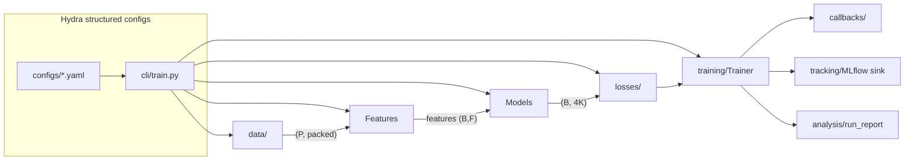

# Architecture

`mpinv` is a single-package Python framework for the phaseless multipole-coefficient inversion problem formalised in [presentation/ch1_full.md](../presentation/ch1_full.md). The codebase is laid out as a small set of layers with strict, well-typed boundaries:

```
core/        tensor-shape contracts, packing, grid, area weights, seeds, types
data/        synthetic generator, real-antenna loader, memmap dataset, basis cache
features/    PCA, FFT-radial, HOG, SH-power, normalisers, composite pipeline
models/      registry, base, MLP variants, linear baselines
losses/      registry, coefficient MSE, physics power loss, differentiable VSH decoder
training/    Trainer, optimiser builder, AMP, sanity checks
callbacks/   logging, validation, checkpoint, early-stopping, grad-clip, memory watchdog
tracking/    MLflow sink, dataset logger, params helper
analysis/    plot modules, run report, metrics
cli/         train, evaluate, sweep, generate_data, validate_physics, report
```

## End-to-end flow



## Hard invariants

- **Single canonical layout** for the angular grid: `(B, n_theta, n_phi)`. The numpy-side synthetic generator computes in `(B, 2 family, 2 component, n_theta, n_phi)` and the differentiable decoder consumes the same tensor as a buffer.
- **Phase units are radians** inside the package; the only conversion happens once in [src/mpinv/data/real_antenna_loader.py](../src/mpinv/data/real_antenna_loader.py).
- **Single source of truth** for every registry: see [src/mpinv/models/registry.py](../src/mpinv/models/registry.py), [src/mpinv/losses/registry.py](../src/mpinv/losses/registry.py), [src/mpinv/features/registry.py](../src/mpinv/features/registry.py). Importing duplicates is a bug.
- **No silent reshape** inside losses or feature pipelines. Shape assertions raise; we never bilinearly resize a target to match a prediction.
- **No PyTorch Lightning**. Custom callback-driven [Trainer](../src/mpinv/training/trainer.py) per the practice.pdf rationale.
- **No `mlflow.pytorch.autolog`**. Explicit logging only.

## Forward operator (production path)

Synthesis goes through a precomputed VSH basis tensor of shape `(K, 2, 2, n_theta, n_phi)` (K modes × 2 families × 2 components × angular grid). The basis is computed once with NumPy/SciPy at the project's 1° pole-excluded grid and cached at `data/cache/`. The differentiable decoder ([src/mpinv/losses/differentiable_field.py](../src/mpinv/losses/differentiable_field.py)) holds the basis as buffers and runs `einsum` to compute the complex tangential field, from which it returns the real power pattern `P = |E_theta|^2 + |E_phi|^2`.

We deliberately do **not** use `torch_harmonics.InverseRealVectorSHT` for the production forward, because:
1. it returns a real-valued tangential field — but we need a complex field whose modulus squared yields P;
2. the legacy `(l, m)` indexing on top of it had documented bugs (see [research/framework-rebuild/manifest.md](../research/framework-rebuild/manifest.md) R1);
3. its `equiangular` grid includes the poles, while the project's grid excludes them.

`torch-harmonics` is still pinned as a dev/test dependency for cross-checks.

## Configuration

[Hydra 1.3 with structured configs](https://hydra.cc/docs/intro/). Top-level `configs/train.yaml` composes `data`, `features`, `model`, `loss`, `optimiser`, `scheduler`, `trainer`, `callbacks`, `tracking` via the `defaults:` list. CLI overrides land directly on these groups, e.g.

```bash
uv run mpinv-train model=mlp_pyramid loss=physics_power trainer.max_epochs=200
```

Object construction uses `hydra.utils.instantiate(cfg.x)` only at leaves. Composition between leaves is plain Python.

## Tracking & reproducibility

- MLflow 3.x — see [docs/mlflow_runbook.md](mlflow_runbook.md).
- `uv` for environment management; `uv.lock` is checked in.
- `ruff` for lint+format, `ty` for typing, `pre-commit` for the pre-commit hooks.
- Random seeds set globally via [`mpinv.core.seeds.set_global_seed`](../src/mpinv/core/seeds.py).
